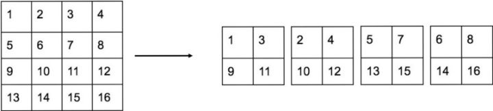

//论文阅读。  
//感觉可以研究的两个方向:  
1、bottom-up一步生成各个关键点坐标的精确性，(ae好像对分类已经做的不错了)  
2、3d的pose预测。  
3、multi-scale的问题。  
before:有空补。  
补:  
2018.03.27  
1、Learning Feature Pyramids for Human Pose Estimation(在mpii单人测试依然排名第一)  
主体结构还是hourglass，也属于top-down方法，不过作者主要focus在第二步，即关键点detection。主要创新点有以下几个：
a.对residual module进行了深入挖掘，一口气提出了四种称之为PRM(Pyramid Residual Modules,金字塔残差模块)的结构,具体来说就是传统的residual module都是针对一个scale的feature maps来进行特征提取，而PRM采用了多个scale的feature maps(具体方法就是下面提到的fractional pooling，分数卷积)。
b.fractional pooling,即卷积的缩小倍数不是整数倍，为的是获取多个scale的feature maps，但实测效果不佳，有可能是参数没调好或者其他未知原因。  
c.提出了一中多branch的初始化方式，但是在github上的代码里并未释出。  
d.解决了variance explosion的问题,即在hourglass的上采样那里identity mapping改为了一个卷积操作。  

2018.03.28  
1、Adversarial PoseNet:A Structure-aware Convolutional Network for Human Pose Estimation
适用于：单人，detection那步也被省略了。把hourglass和gan网络结合了。(作者在github上说1月就放出代码，现在去看，他竟然把那个responsity删了。。。。)
网络结构：  
    a.生成网络G，主体结构为hourglass的copy，区别在于输出，改为两种heatmaps，一种为gt,一种为occlussion；另外，在一个hourglass中又分为两个部分，上半部分产生的gt，下半部分产生occl。  
    b.判别网络分为两个P与C，其中C用以判断一个heatmap的置信度，输出一个1*16的vector，每个element表示对应关键点heatmap位置的得分；P用以判断关节点的位置是否正确，也输出一个1\*16的vector，每个element代表是否在正确位置。  
    loss为g的loss(应该为mse)+两个判别网络的损失。  

2、RMPE：Regional Multi-Person Pose Estimation(最新更新的版本在mpii多人测试中已经排名第一，但没有登出不知为何)
SJTU的一篇论文，典型的top-down方法，其中两个部分的主体方法都是用的现成的，即faster-rcnn+pyranet。  
主要的创新点的话有以下几个：  
a.一个对称的stn网络，其中取得参数theta的localisation网络在定位网络之后，de-transform在pyranet之后(用以将经过仿射变换的图像变换回原坐标);  
b.一个并行的stack hourglass网络，这个网络是为了不影响主路的精度，从实验结果来看并没啥大影响(降了1.7个百分点);
c.参数化的nms(非最大值抑制)，为的是减小detection部分的冗余，消除标准就是一堆公式，感觉很吃硬件,对最终结果影响很大，降了大概5个百分点；  
d.Pose-guided Proposals Generator,对于划分好的atom pose(元姿态),通过学习不同atom pose的detected bounding box和gt bounding box之间的相对偏移的分布，并通过k-means算法聚类找到相似的pose，然后通过detection生成的bounding box来生成一个对应的伪gt bounding box来提升性能,这个对最终结果影响最大，有8个百分点；  

3、


 
2018.03.23  
1、cpn(级联金字塔网络)  
用于:关键点检测,属于top-down方法。  
大体方法:  
a.网络结构。属于top-down类,其中第一步的detector基于fpn(特征金字塔网络)+mask rcnn中的roiAlign,属于直接拿来用的部分,略过不谈;第二步即关键点检测部分,采用的是两个net,  
    其一称为globalnet,用以检测easy points,即容易定位的关键点,整体是个U-shape,类似fpn,原理大概是浅层特征能够较好地定位关键点信息,但是由于感受野较小,难以提供用以识别的语义信息;深层特征由于感受野较大拥有较丰富的语义信息但由于conv和pool的原因分辨率较小难以提供准确的关键点信息;因此使用U-shape结构可以较好地融合这些信息来获得比较好的检测定位效果(说白了就是将各个层的信息相加呗),至于loss的计算,由于是在每个融合特征层进行分别预测,那么尺寸是不一样的,所以对每一层而言heatmap的尺寸也是不同的(应该是进行resize操作了的？);  
    其二称为refinenet,用来检测定位前面globalnet不能很好地预测的关键点hard points,如被遮挡的部分,具体来说就是globalnet中的每层feature经过一定数量的bottleneck(应该就是residual模块,浅层用的少,深层用的多)后再经过upsampling操作,最后不同层的结果进行concat(与hourglass的+不同)。另外,为了让refinenet专注于定位hard points,原文采用了一个称之为hard points online studying的方法,说白了就是设定一个hardpoints的数量m,然后在refinenet反向传播loss的时候只把所有关键点里loss为前m个的传回去(具体实现,个人觉得是把其他的关键点的loss置为0即可),原文中选的m值为总关键点数量的一半,效果最好。  
b.数据预处理。原文实验表明256\*192的效果和256\*256的效果一样好,因为人的尺寸一般不是方形的,但更节省内存,可以用于提高batch size;图片尺寸越大,效果越好;rotation、scale等常用手段,以及large batch,这个很重要。  

2.fpn(特征金字塔网络)  
用于:理论上可用于任何cnn结构。  
大体方法:  
a.网络结构,和一般的bottom-up不断subsampling并提取高层特征再top-down不断upsampling融合各层特征且只在最后一个upsampling层进行预测不同,fpn在top-down阶段的每一层融合特征后都进行预测,上一层的特征经过upsampling后与subsampling阶段对应channel的特征进行融合然后再进行预测,每层都如此。  
b.数据预处理,未明。  

2018.03.26  
1.associated embeddings:xxxx  
用于:多人目标检测和实例分割(好像这块作者做的不是很好暂时不提了)。本文作者从开始就一直在输出一个观点，即许多cv任务都可以看作是两个大的过程:detection+grouping,检测+分组。用在human pose estimation这方面，就是检测各个关键点+将各个关键点分离为独立的个人，本文所设计的两个损失函数也是基于这一观点出发的。(不知道是不是观点输出太强烈了所有被ICCV给rejected了。。。)  
大体方法:  
a.网络结构,大致同之前的hourglass,但是存在以下更改:  
    1、残差模块改为3*3卷积;  
    2、在每个stage进行subsampling时输出的特征图增多(256->386->512->768);  
    3、输出的heatmap变为两种,分别为:  
        detection heatmaps,即检测各个关节点位置的heatmaps,且为多人的(即一个heatmap中可能存在peaks),对应的detection loss即为mse，和之前的相同;  
        tag heatmaps,这个比较有意思，有点类似半监督的方式？(不太懂),即让网络自己去学习对各个不同的人的不同关节点进行编码,使得同个人的各个关节点的编码值应该是一样的，而不同的人之间关节点的编码值应该是区别较大的，这就引出了作者设计的group loss,主要分为两部分:  
            第一部分是针对单人内部各个关键点而言的，本质上就是计算方差，即先根据gt位置找到tag   heatmaps中的各个值，然后先算出所有关键点的值的均值，接着计算方差，然后对图中的所有人进行相同的操作并对结果取均值即构成了group loss的第一部分；  
            第二部分是针对不同人之间而言的，计算出每个人各个关键点的均值之后，所有人两两之间的均值的差平方后再取负并作为exp的指数，易知这一项应该越小越好，即不同个体间的编码值差距越大越好。  
        两部分相加即构成了所谓的group loss。  
        根据两个损失的定义可以看到，其实detection和group在训练时是没有什么交集的(loss之间可能存在相互制约？这方面没细想),训练时group操作使用的关键点坐标是ground truth的而不是predicted(说不定可以在这个地方做下文章？),而且从后文的实验结果可以看出，作者在一部分测试集上也使用了ground truth 的坐标而不是predicted的坐标来进行实验，结果提升非常大，这也从侧面说明了限制最终结果的瓶颈在于关键点的detection，且从实验结果放出的图可以看出，tag heatmaps对不同的人的关键点的分割已经十分准确(对于单个人的各个关节点而言，tag的value基本上在一个数值上；对于不同人之间的关键点而言，数值基本上差距十分明显)。另外，在具体实现过程中作者在group loss之前加了一个系数1e-3。  
b.具体实现细节:  
    1、测试时如何将各个关键点分发到相应的个人？  
        采用的方法是迭代并从躯干、头部再到四肢，根据躯干关键点对应的detection heatmap通过nms(非最大值抑制，说白了就是通过设置一个threshold找到各个peaks,感觉这个阈值的设置还是挺重要的，设置小了会导致判别人数多了，设置大了可能导致判别人数比实际的少)来确定人数，并找到对应tag heatmap中peak位置对应的值，这样就形成了初始的状态，然后开始迭代过程：根据各个关键点的detection heatmaps找到对应peak位置tag heatmaps的值，并根据其peak的值的大小及对应tag的值的大小共同判断是否属于现有人物中的某个的关键点(具体来说还是设置一个阈值),若对于现有的所有人都不match，则新增一个人物(说明该人物的某些关键点被遮挡或截断了)；重复上述过程直至所有的关键点都有所属人物为止。  
        另外，在测试中作者采用了多个scale来应对不同scale的人的问题，相应的detection heatmaps取了avg，而对于tag heatmaps则进行了concat操作变成一个向量，然后直接比较向量距离而不是如上述所说根据peak值大小及tag值大小共同决定所属类别。  

2.A simple yet effective baseline for 3d human pose estimation  
大体方法：  
a.网络结构，hourglass+直接回归。感觉没啥亮点，要说有的话，可能就是回归那里用了个类似残差模块的东西，即把最初输入加到输出里了。  

2018.03.27  
1、Towards accurate multi-person estimation in the wild+PersonLab  
a.网络结构：faster-rcnn+cnn(先扣出单个人再进行关键点定位,具体结构为resnet类)  
把问题看成是分类+回归问题，首先是分类(如下a所述)：将heatmap中各个像素点分为两类，值为1的表示在真实位置一定范围内，否则为0；然后是回归(如下b所述)：即对每一个关键点k生成一个矢量图，表明每个像素点的位置与关键点k的位置的偏移(xk-x),从图上来看，就类似于对于每个gt关键点k，其他像素点均从自己出发指向k。  
主要是改变了heatmaps的生成方式，从原本简单的二维高斯核变为：  
    a.对于距离gt keypoint位置小于一定距离R的像素点值均置为1，形成一个圆形;  
    b.offset vector，即每个像素点的值为其位置与真实位置的差，是个2-channel向量(personlab中限定了像素点为a中的值为1的)。  
    最终生成的heatmap由这两个融合而成，是一种hough transform(霍夫变换)的形式。  
    所谓hough voting:  
    对于图像空间中的任意一个点(x,y)对应于霍夫空间中的一条曲线，然后霍夫空间中的对应曲线上的每一个点都进行+1操作;对图像中每个点都进行上述操作后，最后在霍夫空间中强度最大的一个点就是要找的点(霍夫空间的坐标),再将其映射回原图像空间即可得到对应的形状。  
    然后论文中的bilinear kernel，又被称为Triangular kernel，即三角核函数。一维时的表达式为f(x)=1-|x|,也很容易推出二维时的表达式:g(x,y)=1-sqrt(x\*\*2+y\*\*2)  
    另外，a、b的生成是使用了atrous conv(空洞卷积)。  
    与此同时，相应的损失函数也改了：  
    对于a而言，使用的损失函数为logistic loss，即经典的二分类损失,计算loss是对整幅图片尺寸大小进行计算(排除了关键点未完全标记的部分);  
    对于b而言，使用的损失函数为L1 loss(personlab)/Huber loss(G-RMI),计算loss时只计算在R范围内的(personlab)并且,除以R以normlize(personlab);
    另外两种loss间存在权重关系。    
    Q:    
    1、对于被遮挡的点，probmaps应该为全零还是和未被遮挡的点一致？对于不存在的点，probmaps应该为全零？那么对应的offset应该为什么形式？    
    2、通过probmaps和offsets来得到locmaps时,若使用循环那么速度太慢，但如果使用6维的张量([h,w,b,h,w,n])则会报memory error，所以要怎么办呢？    
b.  


2、ArtTrack: Articulated Multi-person Tracking in the Wild  
deeper cut的进化版，相比于其他的不咋地。  

3、Binarized Convolutional Landmark Localizers for Human Pose Estimation and Face Alignment with Limited Resoures  
目标是在保存性能的情况下减小gpu显存的利用,主要使用的是二值卷积，即权重的值不是1就是-1。  
结论：binary效果相比非binary的不太行(降了大概10多个百分点),但是作者声称可以在单个cpu上实现实时的效果;但是使用它改进的residual module能在减小计算负担的情况下稍微提升测试结果。  


2018.04.10  
1、Faster-RCNN two-stage算法，第一步产生region proposal(RPN网络)，第二步对这些proposal进行分类及回归操作(fast rcnn网络)。  
可以看作是RPN+Fast-RCNN,其中RPN用以产生候选区域和概率，用作Fast RCNN的输入。  
    a.RPN的大致流程：  
    ①.输入的图像通过一个cnn(resnet等)提取特征并生成一系列feature maps;  
    ②.在feature maps上做slide操作。具体来说，即对feature map做3\*3卷积(不知道这个是干啥，可能是为了再提取一次信息、进一步提高reception field？)。对于一个h\*w的feature map上的每一个像素点均对应有k个不同的anchor(即候选区域，不同的scale和ratio,为什么叫做anchor，本人的理解是这个anchor候选框就像是一个基准一样，后面得到预测的bounding box时是通过上一次更新后的anchor作为基准再进行相应的线性变换从而得到的和gt bounding box更接近的框,另外，anchor的四个坐标是根据图片的大小预先生成的，基本上可以涵盖各种各样的形状),故对于一张feature map，可以产生h\*w\*k个anchor;  
    ③.分两路，一路用作分类，即对每个anchor进行正负label的判别，产生2k个scores(分为前景和背景，对feature map中的每个像素点而言),故最终的输出为h\*w\*2k,使用的是softmax交叉熵损失(logistic也可);另一路用作回归，对feature map中的每个像素点均产生4k个坐标((x,y,w,h),中心坐标和anchor的宽、高,表示预测的值)，总共为h\*w\*4k。  
        note:关于回归的loss，预测的四个值并非为直接的[x,y,w,h]，而是使用了所谓的parameterizated coor,输出的为一种变换$t=[t_x,t_y,t_w,t_h]$,即学习一种变换t,使得anchor经过变换t后得到的bounding box(也是新的anchor)和gt bounding box差距减小，设真实的变换为t*,则优化的目标就是是学习的变换t和真实的变换t*之间的差距尽可能地小，这里回归部分使用的是smooth_l1_loss。另外，论文中采取的变换为平移(改变x、y)+缩放(改变h、w)，对应的变换公式为：  
        $x_{pred}=t_x*w_a+x_a,->t_x=\frac{x_{pred}-x_a}{w_a}$  
        $y_{pred}=t_y*h_a+y_a,->t_y=\frac{y_{pred}-y_a}{h_a}$  
        $w_{pred}=w_a*e^{t_w},->t_w=log(\frac{w_pred}{w_a})$    
        $h_{pred}=h_a*e^{t_h},->t_h=log(\frac{h_pred}{h_a})$    
        其中t=[t_x,t_y,t_w,t_h]即为需要学习的参数;真实的$t^*$将$x_{pred}、y_{pred}、w_{pred}、h_{pred}$换为gt即可，损失计算公式：  

    ④.proposal layer。大致步骤如下：  
        根据t来生成新的anchors；  
        使用分类路的分数大小来对anchor进行排序，取前N个；
        将anchor坐标映射回原图像进行边界超出判断，剔除超出图像尺寸的anchor；  
        剔除尺寸过小的anchor；  
        进行NMS(非最大值抑制);  
        再次排序，取前x个作为输出(即候选),注意此处输出的是[x1,y1,x2,y2]为左上角和右下角的坐标；  
    RPN部分到此即结束。  
    b.ROI pooling，因为传统的cnn训练好之后输入图片的尺寸必须固定，而在RPN部分生成的proposal尺寸并不固定，传统的解决方法即crop或warp，但会破坏原图的结构，故faster rcnn采用了所谓的roi pooling,接收两个输入，一个是共享conv产生的feature maps，一个是proposals。  
    原理：先将proposal映射回原feature map尺度h\*w，然后将每个proposal垂直和水平分别分为pooled_h份和pooled_w份，并对每一份进行max pooling处理，这样输出的就是固定尺度的proposal了(pooled_h\*pooled_w,注意实际过程中可能不整除，所以在tf中需要自己写一个op,在最新的tensorflow object detection模型中，采用的实现方式是：we use Tensorflow’s “crop and resize” operation which uses bilinear interpolation to resample part of an image onto a fixed sized grid)。  
    c.再次对上一步获取的固定大小的proposals进行分类(和前面不同，是类别分类而不是前后景分类)与回归(和前面相同，为的是进一步生成更精确的坐标)，得到更为精确的坐标和分类结果。  
    d.实际训练过程：   
        1、在已经训练好的model上，训练RPN网络，对应stage1_rpn_train.pt  
        2、利用步骤1中训练好的RPN网络，收集proposals，对应rpn_test.pt  
        3、第一次训练Fast RCNN网络，对应stage1_fast_rcnn_train.pt  
        4、第二训练RPN网络，对应stage2_rpn_train.pt  
        5、再次利用步骤4中训练好的RPN网络，收集proposals，对应rpn_test.pt  
        6、第二次训练Fast RCNN网络，对应stage2_fast_rcnn_train.pt  

2018.04.11  
1、YOLO类 one-stage算法，使用一个cnn框架进行回归和分类。  
    *v1*  
    大致思想：将一张输入图片分为SxS的单元格，每个单元格用以检测目标物体的中心落在单元格内的物体，且每个单元格会预测b个检测框(适应不同比例的物体,但在训练过程中只选预测的检测框与gt框IOU最大的进行loss计算，其他的框忽略)及检测框对应的置信度，为检测框预测含有目标的概率乘以检测框与gt框之间的IOU,注意此处对于训练而言得到的直接就是一个置信度$c_i^{pred}$,而对于gt的置信度而言并不一定为1，只有两项中的存在目标物体的概率为1，而iou则需要具体计算，即gt的置信度一般是小于1的；另外，对于检测框而言，有4个值：[x,y,w,h],分别表示预测的检测框的中心坐标和宽高,即在回归部分每个单元格总共需要预测5个值。  
    以上为回归的部分，还需要有分类的部分，即对于每个单元格而言还需要其给出c个类别的概率值，注意此处是对单元格而不是检测框而言，即在yolov1中每个单元格只能对应于一种类别。  
    故对于每个单元格而言总共需要给出(5*b+c)个预测，对于原文中，s=7，b=2，c=20，则最终的输出为[7,7,30]的张量。  

loss:分两类，分别为定位误差和分类误差，均采用mse。具体可见图:  
a.回归误差  
$L_{coord}=\lambda_{coord}\sum_{i=1}^{S^2}\sum_{j=1}^{b}1_{ij}^{obj}[(x_i^{pred}-x_i^{gt})^2+(y_i^{pred}-x_i^{pred})^2+(\sqrt w_i^{pred} - \sqrt w_i^{gt})^2+(\sqrt h_i^{pred}-\sqrt h_i^{gt})^2]$  
其中，$1_{ij}^{obj}$表示第i个单元格内存在目标物体的中心，且该物体由该单元格的第j个检测框来负责检测(具体来说就是第i个单元格的所有检测框中与gt的框IOU最大的那个),那么问题就来了，训练过程中是在每次迭代时都要重新确定一次检测框还是在第一次确定之后就一种使用该检测框呢？(据说是每次动态确定，实际情况还是等看了源码再说把)  
b.类别误差  
$L_{obj}=\sum_{i=1}^{s^2}\sum_{j=1}^b1_{ij}^{obj}(c_i^{pred}-c_i^{gt})^2$  
$L_{noobj}=\sum_{i=1}^{s^2}\sum_{j=1}^b1_{ij}^{noobj}(c_i^{pred}-c_i^{gt})^2$  
$L_c=\sum_{i=1}^{s^2}1_{i}^{obj}(P_i^{pred}(c)-P_i^{gt}(c))^2$  
上式中，$1_i^{obj}$表示单元格内存在物体且判断为各个类别的概率；$1_{ij}^{noobj}$表示不存在目标物体的检测框，即对于某个单元格而言，其所有的检测框中预测不存在目标物体的均加入计算，且对于后面的平方项而言，gt的置信度应该为0，因为对于不存在目标物体的单元格，其真实的存在目标物体的概率应该为0。    


一些细节部分:  
1.关于每个检测框预测的5个值[x,y,w,h,c]  
x、y为预测的检测框的中心点，无单位，是相对于其所属单元格左上角的比例；而预测的w、h是经过开根号的，这在loss中也可看出，这是因为对于小目标的物体，检测框尺寸的变换更应该敏感一些。  
2.关于IOU的计算  
看代码的计算其定义应该为：预测的框和真实的框相重合的面积s1除以预测的框和真实的框取并之后的面积。  
3.label的准备  
对于不存在目标物体的单元格label是如何准备的？对于不存在目标物体的单元格的IOU如何计算？？？(直接为0)具体见 \url {https://note.youdao.com/share/?id=cfe081b9980b9623feaadfc81d00de94&type=note#/}  
4.loss公式中$1_{ij}^{obj}$及$1_{ij}^{noobj}$的相关代码部分  
```python
#[b,s,s,boxes]
#计算iou这步就可以把所有不存在目标的单元格的各个检测框给搞定(置为0)
iou_predict_truth = self.calc_iou(predict_boxes_tran, boxes)

# calculate I tensor [BATCH_SIZE, CELL_SIZE, CELL_SIZE, BOXES_PER_CELL]
object_mask = tf.reduce_max(iou_predict_truth, 3, keep_dims=True)
#转换为true或false
#这个就是公式中的 1_{ij}^{obj}
object_mask = tf.cast(
    (iou_predict_truth >= object_mask), tf.float32) * response

# calculate no_I tensor [BATCH_SIZE,CELL_SIZE, CELL_SIZE, BOXES_PER_CELL]
#这个就是1_{ij}^{noobj}
noobject_mask = tf.ones_like(
    object_mask, dtype=tf.float32) - object_mask
```
*v2*  
插一个概念:精确率(precision)、召回率(recall)  
精确率的定义：预测为正的样本中的确为正的样本的比例，即：  
$P=\frac{TP}{TP+FP}$,TP表示预测为正真实也为正的样本，FP表示预测为正真实为负的样本；  
召回率的定义：预测为正的样本占所有真实正样本的比例，即：  
$R=\frac{TP}{TP+FN}$,FN表示预测为负真实为正的样本。  一图敝之： 

相对于v1的改进有：  
1.新的网络结构：darknet-19  


计算量大约减少了33%。  
2.使用了和faster-rcnn一样的先验框(anchor boxes)策略  
a.与yolov1不同，现在yolov2的每个检测框均对应于一套类别的预测；  
b.和faster-rcnn的变换t不同，作者认为faster-rcnn的变换形式是无约束的，变换后的新的anchor的位置可以出现在图片的任何地方，yolov2使用了一种新的变换形式,即预测检测框中心点相对于当前cell(就是经过darknet后产生的特征图的一个点)左上角的偏移，$t=[\sigma(t_x),\sigma(t_y),t_w,t_h]$(训练时输出的不带sigma，但是计算loss时会先将前两项约束到1然后进行坐标loss的计算),且使用sigmoid函数将其限制在当前cell范围内，故这样训练起来效率更高。具体的变换式子如下:  
$x_{pred}=\sigma (t_x)+x_c$  
$y_{pred}=\sigma (t_y)+y_c$  
$w_{pred}=w_a*e^{t_w}$    
$h_{pred}=h_a*e^{t_h}$  
注意上面的坐标的单位均为在特征图cell个数下的，即cell的长框均看作1，总共多少个cell就总共多长多宽。记特征图的长宽分别为$w_{feat}$、$h_{feat}$，原图片的大小分别为$w_{img}$、$h_{img}$,则有:  
$x_{pred}^{abs}=\frac{x_{pred}*w_{img}}{w_{feat}}$   
$y_{pred}^{abs}=\frac{y_{pred}*h_{img}}{h_{feat}}$   
$w_{pred}^{abs}=\frac{w_{pred}*w_{img}}{w_{feat}}$   
$h_{pred}^{abs}=\frac{h_{pred}*h_{img}}{h_{feat}}$   
一图敝之：  

3.细粒度特征(Fine-Grained Features)  
尺寸小的特征图语义层次更高，一个像素点对应于原图的区域大，即感受野大，利用检测大的物体，但是对于小的物体而言，需要前面尺寸大的特征图，为了解决这个问题，yolov2提出了所谓的passthrough层(也称为reorg layer)，其实和resnet的identity map类似，即将前面更高尺寸的特征图的wh维度转换为channel维度，使得转换后的wh和后面的特征图的wh相同，然后concatenate channel维度即可：(在tf中可以tf.space_to_depth实现)    

4.multi-scale training,多尺度图片训练  
每个10个epoch随机更换一组图片尺寸进行训练，使得模型可以适应不同大小的图片。  
  

训练流程：  
YOLOv2的训练主要包括三个阶段:  
1.分类器 低分辨率  
第一阶段就是先在ImageNet分类数据集上预训练Darknet-19，此时模型输入为224x224，训练160个epochs;  
2.分类器 高分辨率fine-tune  
第二阶段将网络的输入调整为448x448，继续在ImageNet数据集上finetune分类模型，训练10个epochs，此时分类模型的top-1准确度为76.5%，而top-5准确度为93.3%。  
3.检测器  
第三个阶段就是修改Darknet-19分类模型为检测模型，并在检测数据集上继续finetune网络。网络修改包括：移除最后一个卷积层、global avgpooling层以及softmax层，并且新增了三个 3x3x2014卷积层，同时增加了一个passthrough层，最后使用 1x1卷积层输出预测结果，输出的channels数为：num_anchorsx(5+num_classes)，和训练采用的数据集有关系。  

loss:  
一图敝之，懒得解释了，太多。。：  


2018.05.xx  
SSD:Single Shot Detector  
*v1*  

2018.04.20  
1、Adversarial Complementary Learning for Weakly Supervised Object Localization    
用fcn做分类时最终产生的c个类别的feature maps，研究发现分类任务往往是靠目标类别的某一部分来进行的，即对应的featuremaps只有对应的部分响应较高，这篇文章使用的方法就是强制先把第一个分类器产生的locationmaps的响应部分置0然后扔给第二个分类器强迫它通过别的部分来进行分类，这样最后把两个locationmaps进行max(pixel_a,pixel_b)，即找到每个对应像素位置的最大值来得到整个目标的响应。

2018.04.25  
1、multi-context attention for human pose estimation    
    基于hourglass结构，有以下三点创新：  
    a.引入了CRF(条件随机场),注意力机制；  
    CRF(条件随机场)属于无向图模型，是指给定一组输入随机变量的条件下另一组输出随机变量的条件概率分布模型。图中的节点表示为随机变量，设所有随机变量集合为Y,边表示变量之间的依赖关系，设无向图所表示的联合概率分布为P(Y)。  
    首先，概率无向图模型中最大团的定义：无向图中任意两个节点间均有边连接的节点子集称为团，若团中无法再加入新的节点，则称对应的团为最大团。若图中节点太多，则联合概率P(Y)可分解为各个最大团的联合概率乘积表示，这个由Hammersly-Clifford law定理保证:  
    $P(Y)=\frac{1}{Z}\prod_{c}Ψ_{c}(Y_{c})$  
    $Z=\sum_{Y}\prod_{c}Ψ_{c}(Y_{c})$  
    其中,$Ψ_{c}(Y_{c})$是c上定义的严格正势函数，一般取指数函数:  
    $Ψ_{c}(Y_{c})=e^{-E(Y_{c})}$  
    b.multi-context attention,包括multi-resolution attention、multi-semantics attention、hierarchical visual attention。  
    c.hourglass residual unit(HRU)，专门为hourglass结构设计的残差模块，在原本残差模块的基础上加上了第三条支路，即类似hourglass整体结构的top-down-top结构，这部分相对来说应该比较好理解。


2018.04.27  
1、vnect
    不仅回归heatmaps，还回归 所谓的location-maps。  

2018.05.01  
1、3D Human Pose Estimation from a Single Image via Distance Matrix Regression  
    two-step，第一步先使用hourglass/cpm得到2d关节点位置；第二步，先将预测出的各个关节点转换为edm,然后作为输入，gt的label也是edm表示，loss使用l2 loss;第三步，从edm中转换为3d pose，使用的公式：  
    $arg min_{p_1,...,p_n}\sum_{m,n}|||p_m-p_n||^2_2-edm(y)^2_{m,n}|$    
    其中$p_m,p_n$是3d pose中各个关节点的坐标。  
    Euclidean distance matrix(edm)的解释：


2、Towards 3D Human Pose Estimation in the Wild: a Weakly-supervised Approach  
end-to-end,two modules，其一为hourglass模块，其二为深度回归模块，与其他人不同的是，作者不仅将2d pose预测的关键点(heatmaps)作为输入喂给深度回归模块，还把2d pose预测模块中的中间产生的feature maps一并喂进了深度回归模块;另外，针对没有标注深度信息的数据集，作者通过一个人体几何约束来作为损失，具体来说即：对于正常人而言，各个关节点间的骨头长度的比例应该是相对固定的，利用这一点，作者首先计算出所有骨头的平均长度$l_e^-$,然后将骨头按照类别相似性分为几组，(文中分为了四组，分别为:{左右、上下臂}、{左右、上下腿}、{左右肩}、{左右臀},另外，由于人体躯干部分长度变化较大，故作者在实验中未将其纳入实验中),记$l_e$为某一骨头的长度，$R_i$为某一分组，那么有：  
    1.$ratio=\frac{l_e}{l_e^-}$  
    2.$r_i=\frac{1}{|R_i|}\sum_{e\in R_i}\frac{l_e}{l_e^-}$(即求均值)  
    3.$L_{geo}=\sum_i\frac{1}{|R_i|}\sum_{e\in R_i}(\frac{l_e}{l_e^-}-r_i)^2$(即求方差)  
另外，从像素坐标系到相机坐标系的坐标转换公式：(TODO)  

关于训练，作者在论文中分三步：  
    a.首先仅使用2d数据集训练hourglass模块；  
    b.同时使用2d、3d数据集(对半分，随机采样)训练深度回归模块及fine-tune hourglass模块，不使用几何约束损失(即$L_{geo}$);  
    c.fine-tune整个网络，使用$L_{geo}$。  

2018.05.04  
1、Deep Multitask Architecture for Integrated 2D and 3D Human Sensing  
这篇论文的网络结构总感觉和cpm的有些相似(看了下github上的源码发现就是抄的cpm)，总体网络结构图如下：  
图中，$x$表示经过7个conv层和3个池化层产生的features，$x^'$表示经过4个conv层和3个池化层产生的features(就是照搬了cpm中的);$c_J^t$(图中未画出)代表将$x$转换为heatmaps的操作，$c_B^t$代表4个conv层,$c_D^t$同理。

另外，3个loss：  
记$N_J$为关键点数量，$z\in Z$，其中$z$表示像素点位置，$J^t$表示第t个stage的heamaps,$N_R$为3d个关键点数量,有：  
$L_J^t=\sum_{k=1}^{N_J}\sum_{z\in Z}(||J^t_{pred}(z,k)-J^{t}_{gt}(z,k)||^2_2)$;  
$L_B^t=\frac{-1}{|Z|}\sum_{z\in Z}log(B^t_{z\_pred,B^t_{z\_gt}})$;(论文里说是logistic loss)  
$L_R^t=\sum_{i=1}^{N_R}\sqrt(\sum_{j=1}^3(R^t_{pred}(i,j)-R^t_{gt}(i,j))^2+\theta^2)$。    


2018.05.21  
1、Object detection at 200 Frames Per Second  
network distillation：网络蒸馏，详见:Distilling the knowledge in a neural network.  
